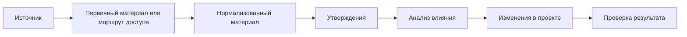

# Как устроен корпус знаний

Корпус знаний хранит связь между проектом и источниками, на которые проект
опирается. В нём видно, откуда взялось утверждение, какой материал был
обработан, какие ограничения есть у источника и можно ли использовать результат
для изменений в проекте.

## Общая схема

## Источник

Источник — место, откуда проект получает сведения. В карточке источника
отдельно фиксируются технический носитель (`carrier_type`), смысловой вид
источника (`source_kind`), способ доступа и ограничения использования.

Технический носитель показывает, как получать, хранить и нормализовать
материал: документ, веб-страницу, сайт, репозиторий, выгрузку данных,
стенограмму, внешнюю систему, медиафайл или другой носитель. Смысловой вид
показывает, как интерпретировать материал: как книгу, статью, справочник,
обсуждение, требование, журнал изменений, набор данных или другой вид.

В описании источника также видно, где материал находится, кто владеет
материалом или системой происхождения, какие ограничения есть у источника и
какой способ хранения выбран для корпуса.

Подробнее см. [«Типы носителя источника»](../20-sources/01-source-types.md)
и [«Как выбирать способ работы с источником»](../20-sources/02-source-decisions.md).

## Первичный материал или маршрут доступа

Первичный материал — сам источник в виде локального файла или копия его данных
в максимально исходном виде. В одних случаях корпус хранит файл или снимок. В
других случаях корпус хранит путь к первоисточнику: ссылку, индекс, правило
точечного доступа или описание локального файла вне Git.

Маршрут доступа помогает вернуться к источнику или выбранной единице источника.
Он может включать способ проверки доступа, ограничения копирования и правило
получения допустимого фрагмента.

Индекс, внешняя ссылка или паспорт источника показывают учёт источника и
маршрут работы. Для фактов, анализа влияния и проектных правок нужен полученный
материал или нормализованный артефакт.

Подробнее см. [«Как выбирать способ работы с источником»](../20-sources/02-source-decisions.md).

## Нормализованный материал

Нормализация приводит первичный материал к виду, удобному для работы в корпусе:
очищенному тексту, структурированному фрагменту, расшифровке или другому
артефакту, пригодному для чтения, поиска, сравнения и извлечения утверждений.

Нормализованный материал остаётся производным слоем и сохраняет связь с тем, из
чего был получен: источником, фрагментом, способом обработки и ограничениями
использования.

Этот этап выполняется после выбора способа работы с источником и появления
проверяемого первичного материала.

## Утверждения

Утверждение — проверяемая единица смысла, извлечённая из конкретного материала.
Оно связано с источником и применимо в понятных границах.

Утверждения помогают работать с корпусом как с основанием для анализа,
требований, правил, решений и документации проекта. По утверждению можно
вернуться к материалу, а от материала — к источнику, способу доступа и
ограничениям.

Утверждения извлекаются только после появления материала, который можно
проследить к источнику и выбранной единице источника.

## Анализ влияния

Анализ влияния показывает, что сведения из корпуса меняют в проекте: документ,
правило, требование, сценарий, настройку, проверку или другой артефакт.

Результат анализа отделяет безопасные правки от вопросов, где нужно решение
владельца проекта. Он также показывает ситуации, где проектные файлы не меняются
или материал исключён из дальнейшей работы.

Анализ влияния начинается после появления проверяемых утверждений и сохраняет
связь с источником.

## Изменения в проекте

Изменения вносятся после проверки источника, области применения, актуальности и
безопасности публикации.

Если источник ограничен лицензией, доступом или условиями использования, корпус
сохраняет это ограничение и учитывает его при переносе сведений в проектные
файлы. Например, источник может разрешать точечную проверку и ограничивать
массовое копирование; тогда в корпусе остаются метаданные, маршрут доступа,
разрешённые фрагменты или производные сведения.

Ограничения доступа и копирования фиксируются в карточке источника и учитываются
при выборе способа работы.

## Проверка результата

Проверка показывает, что цепочка сохранилась: источник учтён, материал можно
проследить, утверждения имеют основание, ограничения сохранены, а изменения в
проекте соответствуют данным корпуса.

Если данных не хватает, корпус показывает это как состояние работы: источник
учтён, индекс обновлён, материал получен, материал нормализован, утверждения
извлечены, влияние проверено, правки внесены, результат проверен, есть блокер
или отказ.

Типичные причины остановки: нет доступа к источнику, неизвестно происхождение
материала, есть только индекс или ссылка без полученного фрагмента,
нормализация ещё не выполнена, утверждение не связано с конкретным материалом,
ограничение запрещает перенос или нужно решение владельца проекта.

Проверка результата должна сохранять цепочку от проектного вывода к конкретному
материалу источника.
