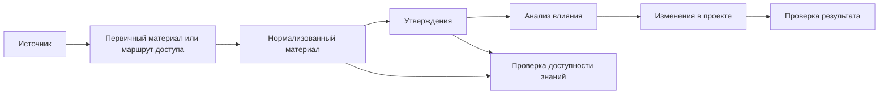

# Как устроен корпус знаний

Корпус знаний хранит связь между проектом и источниками, на которые проект
опирается. В нём видно, откуда взялось утверждение, какой материал был
обработан, какие ограничения есть у источника и можно ли использовать результат
для изменений в проекте.

Рабочая область знаний проекта может включать не только его собственный
внутренний корпус, но и подключённые внешние корпуса знаний, если они
зарегистрированы как источники вида `knowledge_corpus`. Такие корпуса
используются наравне с внутренним, но не копируются в проект целиком.

## Общая схема



## Источник

Источник — место, откуда проект получает сведения. В карточке источника
отдельно фиксируются технический носитель (`carrier_type`), смысловой вид
источника (`source_kind`), способ доступа и ограничения использования.

Технический носитель показывает, как получать, хранить и нормализовать
материал: документ, веб-страницу, сайт, репозиторий, выгрузку данных,
стенограмму, внешнюю систему, медиафайл или другой носитель. Смысловой вид
показывает, как интерпретировать материал: как книгу, статью, справочник,
обсуждение, требование, журнал изменений, набор данных или другой вид.

В описании источника также видно, где материал находится, кто владеет
материалом или системой происхождения, какие ограничения есть у источника и
какой способ хранения выбран для корпуса.

Если источником является другой корпус знаний по этим же правилам, карточка
источника фиксирует только маршрут к нему и ограничения доступа. Индексы,
утверждения, отчёты влияния и другие артефакты читаются прямо из внешнего
корпуса как из подключённого peer-слоя.

Подробнее см. [«Типы носителя источника»](../20-sources/01-source-types.md),
[«Смысловые виды источников»](../20-sources/02-source-kinds.md)
и [«Как выбирать способ работы с источником»](../20-sources/03-source-decisions.md).

## Профиль проекта и политика действий

Корпус может быть публичным или закрытым внутренним. В `corpus.yml` профиль
проекта сопровождается явной политикой действий: получение, внутренняя
обработка, хранение, внешнее раскрытие, удаление и необратимое преобразование
задаются отдельно.

Для закрытого внутреннего корпуса можно разрешить обработку и сохранение
старых, сомнительных и чувствительных сведений с метаданными качества. Это не
разрешает автоматически публиковать их наружу. Тема материала не останавливает
конвейер сама по себе, ограничение всегда относится к конкретному действию.

## Первичный материал или маршрут доступа

Первичный материал — сам источник в виде локального файла или копия его данных
в максимально исходном виде. В одних случаях корпус хранит файл или снимок. В
других случаях корпус хранит путь к первоисточнику: ссылку, индекс, правило
точечного доступа или описание локального файла вне Git.

Маршрут доступа помогает вернуться к источнику или выбранной единице источника.
Он может включать способ проверки доступа, ограничения копирования и правило
получения допустимого фрагмента.

Индекс, внешняя ссылка или паспорт источника показывают учёт источника и
маршрут работы. Для фактов, анализа влияния и проектных правок нужен полученный
материал или нормализованный артефакт.

Подробнее см. [«Как выбирать способ работы с источником»](../20-sources/03-source-decisions.md).

## Нормализованный материал

Нормализация приводит первичный материал к виду, удобному для работы в корпусе:
очищенному тексту, структурированному фрагменту, расшифровке или другому
артефакту, пригодному для чтения, поиска, сравнения и извлечения утверждений.

Нормализованный материал остаётся производным слоем и сохраняет связь с тем, из
чего был получен: источником, фрагментом, способом обработки и ограничениями
использования.

Этот этап выполняется после выбора способа работы с источником и появления
проверяемого первичного материала.

## Утверждения

Утверждение — проверяемая единица смысла, извлечённая из конкретного материала.
Оно связано с источником и применимо в понятных границах.

Утверждения помогают работать с корпусом как с основанием для анализа,
требований, правил, решений и документации проекта. По утверждению можно
вернуться к материалу, а от материала — к источнику, способу доступа и
ограничениям.

Утверждения извлекаются только после появления материала, который можно
проследить к источнику и выбранной единице источника.

## Производные утверждения

Производное утверждение фиксирует проверяемый результат анализа, которого нет
в источниках в готовом виде. Например, корпус может хранить времена начала
работы штабов, а анализ — вычислить долю ночных стартов в заданной выборке.

Такое утверждение хранится отдельно от утверждений источников. Оно ссылается на
входные утверждения, единицы или снимки данных и сохраняет метод, параметры,
область применения и ограничения. Вычисленный результат можно записать как
`observation`, интерпретацию — как `inference`; значение `fact` остаётся за
прямыми утверждениями источников.

Требования, решения и документация могут ссылаться на производное утверждение,
только если вывод можно повторно проверить. Само утверждение не заменяет эти
артефакты, их владельцев и порядок принятия. Изменение входов, метода или
параметров требует пересмотра результата.

## Анализ влияния

Анализ влияния показывает, что сведения из корпуса меняют в проекте: документ,
правило, требование, сценарий, настройку, проверку или другой артефакт.

Результат анализа отделяет безопасные правки от вопросов, где нужно решение
владельца проекта. Он также показывает ситуации, где проектные файлы не меняются
или материал исключён из дальнейшей работы.

Анализ влияния начинается после появления проверяемых утверждений и сохраняет
связь с источником.

## Изменения в проекте

Изменения вносятся после проверки источника, области применения, актуальности и
безопасности публикации.

Если источник ограничен лицензией, доступом или условиями использования, корпус
сохраняет это ограничение и учитывает его при переносе сведений в проектные
файлы. Например, источник может разрешать точечную проверку и ограничивать
массовое копирование; тогда в корпусе остаются метаданные, маршрут доступа,
разрешённые фрагменты или производные сведения.

Ограничения доступа и копирования фиксируются в карточке источника и учитываются
при выборе способа работы.

## Проверка результата

Проверка показывает, что цепочка сохранилась: источник учтён, материал можно
проследить, утверждения имеют основание, ограничения сохранены, а изменения в
проекте соответствуют данным корпуса.

Если данных не хватает, корпус показывает это как состояние работы: источник
учтён, индекс обновлён, материал получен, материал нормализован, утверждения
извлечены, влияние проверено, правки внесены, результат проверен, есть блокер
или отказ.

Часть работы может выполнять не модель, а обычная программа. Получение
материала, преобразование формата, пересборка указателей и проверки структуры —
это механическая работа, и для неё в корпусе можно объявить исполнителя: команду
проекта или адаптер. Нормализация, извлечение утверждений и согласование понятий
требуют смысла, поэтому остаются за агентом. Просить об этом не нужно: настройка
проекта сама предлагает исполнителей, а конвейер возвращается к предложению,
когда в очереди накапливается заметный хвост. Вам остаётся решить, стоит ли
писать нужный скрипт.

Конвейер продолжает все готовые автоматические задачи. Нехватка диска или
исполнителя у одной очереди откладывает её, но не останавливает независимый
хвост. Человеку передаются только сгруппированные решения после безопасных
автоматических попыток и усиленной проверки. Полный хвост сохраняется
машиночитаемо, даже если краткая сводка показывает только ограниченное число
активных групп.

Промежуточный отчёт причиной остановки не является. Пока в доступной очереди
остаются единицы, нет блокера и не исчерпан лимит сеанса, агент продолжает
работу и не возвращает управление человеку ради подведения итога. Просить
«продолжай» после каждой порции не нужно. Если вы задали измеримый критерий
остановки — например, «до нулевой очереди», — он сохраняется в состоянии
прохода и действует до вашей отмены, в том числе в следующем сеансе.

Типичные причины остановки: нет доступа к источнику, неизвестно происхождение
материала, есть только индекс или ссылка без полученного фрагмента,
нормализация ещё не выполнена, утверждение не связано с конкретным материалом,
ограничение запрещает перенос или нужно решение владельца проекта.

Проверка результата сохраняет цепочку от проектного вывода через обычное или
производное утверждение к конкретному материалу источника.

## Проверка доступности знаний

Формальная целостность корпуса ещё не показывает, сможет ли выбранная модель
найти нужный смысл по естественному вопросу. `kc-validation` проверяет сам
корпус без модельного измерения. Для проверки пользовательского пути от вопроса
до ответа применяется
[`kc-retrieval-evaluation`](../../.apm/skills/kc-retrieval-evaluation/README.md).

Проверка начинается с независимо выбранных фрагментов первоисточников. По ним
составляются целевые утверждения и прямые либо перефразированные вопросы.
Отдельные модельные сессии проверяют:

- представлен ли целевой смысл в слое утверждений;
- указала ли отвечающая модель существующее основание в корпусе;
- сохранила ли она смысл и ограничения источника в ответе;
- могла ли она ответить так же без корпуса.

Такой прогон помогает различить пробел извлечения, кандидата проблемы поиска
и искажение ответа. Он даёт выборочную оценку, а не гарантию полноты всего
корпуса.

Начать проверку можно обычным запросом:

```text
Проверь, сможет ли выбранная модель находить важные утверждения через этот
корпус знаний.
```

Навык подготовит воспроизводимую выборку, проверит её формат и отделит
локальный модельный прогон от обычных детерминированных тестов проекта.
До прогона нужно выбрать модель и область источников, настроить локальный
адаптер и подтвердить, что ему разрешено читать корпус и опорные фрагменты.
Подробный первый запуск и границы результата описаны в
[руководстве навыка](../../.apm/skills/kc-retrieval-evaluation/README.md).
