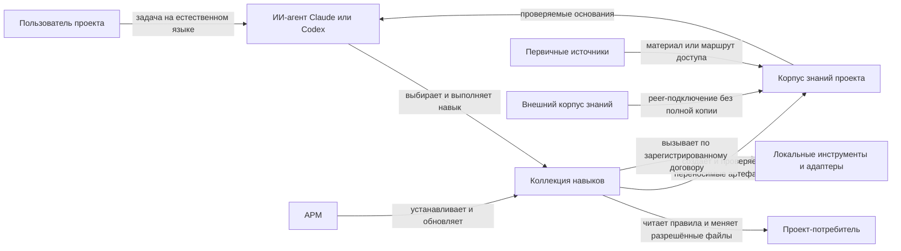
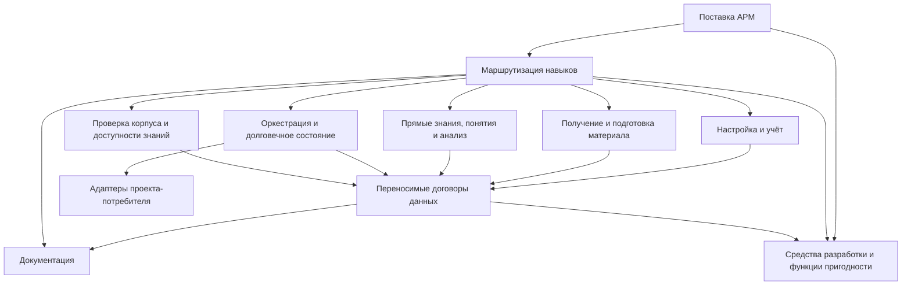
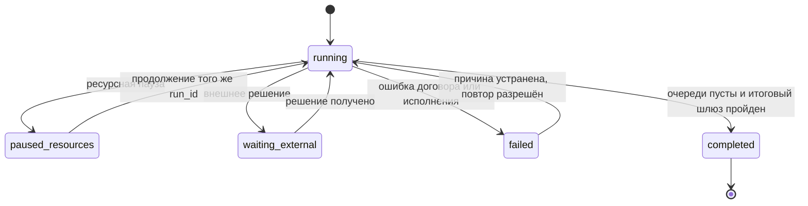

# Архитектура коллекции навыков для корпуса знаний

Статус: действует

Документ объясняет, как
[требования проекта](requirements.md) реализуются границами коллекции,
публикуемых навыков, переносимых договоров данных, исполняемых средств,
документации, поставки и проверок. Значимые решения и история их выбора
хранятся отдельно в [журнале ADR](ADR/README.md).
[Принципы продукта](product-principles.md) задают критерии выбора поведения.

## Назначение и архитектурные силы

Коллекция поставляет ИИ-агентам согласованные процедуры для создания,
сопровождения и применения корпуса знаний проекта. Архитектура должна
одновременно поддерживать:

- сквозную трассировку от проектного вывода к первичному основанию;
- явную видимость неполноты и ограничений обработки;
- переносимость между проектами и средами Claude и Codex;
- отделение публичного отслеживаемого слоя от локальных и закрытых материалов;
- переносимость проверки снимка между окружениями с разной локальной
  доступностью;
- возобновляемое исполнение полного прохода без зависимости от одного сеанса;
- достоверное различение живого исполнителя, прерванной попытки и завершённого прохода.
- максимальное продолжение готовых задач при локальной нехватке ресурсов.
- ограниченный объём сгруппированных решений, передаваемых человеку.
- заменяемость проектных способов получения и обработки источников;
- проверяемость публичных договоров и совместимость поставки;
- изменение одного навыка или договора без неявного рассогласования соседних
  частей.

Главный компромисс проходит между полнотой автоматизации и сохранением
полномочий проекта-потребителя. Переносимое ядро задаёт договоры и безопасные
операции, но не присваивает себе локальные пути, команды, права доступа и
решения владельца. Это снижает риск утечки или необратимой потери данных ценой
явной настройки адаптеров и возможных управляемых пауз.

## Контекст и граница системы



В границу коллекции входят:

- 14 публикуемых навыков в `.apm/skills/`;
- переносимые справочные договоры, шаблоны и исполняемые средства внутри
  пакетов навыков;
- манифест и файл блокировки APM;
- пользовательская документация;
- средства разработки и проверки коллекции.

В границу коллекции не входят:

- сам проект-потребитель и его продуктовые файлы;
- полный материал источников и рабочий корпус этого репозитория;
- внешние сайты, репозитории, сервисы и peer-корпуса;
- модели распознавания, отвечающие модели и другие локальные исполнители;
- секреты, учётные данные, проектные полномочия и правила доступа;
- локальные профили доступа, авторизованные сессии и наблюдения готовности
  адаптера;
- конкретные команды адаптеров, пока проект-потребитель не зарегистрировал их в
  локальной настройке.

Коллекция является устанавливаемым набором навыков и утилит, а не постоянно
работающим сетевым сервисом. Её развёртывание — установка или обновление
APM-пакета, а исполнение происходит в среде агента и проекта-потребителя.

## Статическое представление



### Поставка и маршрутизация

`apm.yml` и `apm.lock.yaml` определяют версию, состав и цели поставки.
Публикуемая единица — вся коллекция, а не отдельный независимо версионируемый
навык.

У каждого навыка собственная связная папка с:

- `SKILL.md` как человекочитаемым и нормативным договором поведения;
- `agents/openai.yaml` как описанием для среды агента;
- `evals/triggers.json` как проверяемым договором выбора навыка;
- `evals/result-scenarios.json` как проверяемыми сценариями результата;
- локальными `references/`, `assets/` и `scripts/`, если они нужны только этому
  навыку.

Граница навыка следует пользовательской задаче и причине изменения. Соседние
навыки взаимодействуют через явно названные результаты корпуса и маршруты
следующего шага, а не через общий скрытый процесс.

### Настройка и учёт

Компонент образуют `kc-setup`, `kc-inventory` и `kc-sources-add`.

- `kc-setup` подключает коллекцию к проекту и выбирает корень корпуса.
- `kc-inventory` владеет переносимым учётным слоем и формальным договором
  раскладки, включая профиль проекта и политику действий с данными.
- `kc-sources-add` создаёт технический маршрут от нового источника к учёту и
  первичному материалу.

Компонент не определяет содержательные выводы и не объявляет наблюдаемую
файловую структуру утверждённым локальным договором.

Переносимый договор источника хранит постоянные требования к доступу, вид
авторизации, необходимые возможности, логическое имя профиля и политику
разрешённого использования. Он не хранит состояние авторизации текущего
окружения. Снимок первичного материала принадлежит корпусу, а
`verification.yml` связывает его хэш с происхождением и результатом проверки.

### Получение и подготовка материала

Компонент образуют `kc-transcription`, `transcript-analysis` и
`kc-normalization`.

- `kc-transcription` получает проверенную сырую расшифровку из локального
  медиа.
- `transcript-analysis` редактирует стенограмму без подмены исходного смысла.
- `kc-normalization` создаёт производное представление первичного материала для
  следующей стадии.

Первичный материал и его производные не сливаются в одну роль. Каждый переход
сохраняет происхождение и ограничения.

### Прямые знания, понятия и анализ

Компонент образуют `kc-statements`, `kc-concepts` и `kc-analysis`.

- `kc-statements` владеет договором прямых утверждений.
- `kc-concepts` ведёт канонический понятийный аппарат продукта в
  `concepts.yml`.
- `kc-analysis` создаёт выводы и, когда нужна устойчивая ссылочная единица,
  производные утверждения.

Прямое утверждение принадлежит материалу источника. Производное утверждение
принадлежит анализу и не может маскироваться под прямой `fact`. Понятийный
аппарат хранит определения, границы, связи и разрешение коллизий, но не
копирует сценарии, шаблоны и развёрнутый контент продукта.

### Оркестрация

`kc-pipeline` координирует готовые способности других навыков. Он не становится
владельцем их предметных договоров.

Исполняемый контур:

- строит автоматические и внешние очереди;
- выбирает готовую автоматическую очередь по доступным исполнителям и ресурсам.
- вызывает только явно зарегистрированные адаптеры;
- для адаптера версии 2 выполняет `probe` перед `fetch` или `verify`, не
  запуская `authorize` автоматически;
- ограничивает разрешённые пути записи;
- сохраняет состояние попытки и полный оставшийся хвост;
- группирует внешний хвост по решениям и ограничивает активные группы.
- различает исполнение, управляемую паузу, ожидание решения, ошибку и
  завершение;
- закрывает глобальные стадии понятий, влияния, переноса изменений и проверки;
- повторяет операционную проверку перед завершением.

Долговечное состояние и правила завершения определены
[ADR-0001](ADR/ADR-0001.md). Политику действий, эскалацию и ресурсное
планирование определяют [ADR-0003](ADR/ADR-0003.md),
[ADR-0004](ADR/ADR-0004.md) и [ADR-0005](ADR/ADR-0005.md).
Разделение локальной доступности и переносимой проверки снимка определяет
[ADR-0007](ADR/ADR-0007.md).

Локальный операционный слой состоит из реестра проектных адаптеров,
игнорируемого реестра профилей доступа и исполнителя адаптера. `probe` создаёт
только локальное наблюдение доступности. `fetch` получает конкретный снимок,
`verify` сопоставляет его с источником, а интерактивный `authorize` доступен
только по явному вызову пользователя. Коллекция владеет договором этих
операций, проект — специфическими адаптерами и политикой, окружение — секретами
и авторизацией.

### Проверка

Компонент образуют `kc-status`, `kc-validation`,
`kc-retrieval-evaluation` и `kc-impact-audit`.

- `kc-status` даёт краткое наблюдаемое состояние без подмены полным анализом.
- `kc-validation` проверяет формальную и смысловую готовность корпуса только на
  чтение по умолчанию.
- `kc-retrieval-evaluation` измеряет пользовательский путь от вопроса к
  основанию и сравнивает ответ с вариантом без корпуса.
- `kc-impact-audit` связывает изменение источника с возможными изменениями
  проекта и решениями владельца.

Проверка отделена от исправления. Она может подготовить проблему, ограничение
или кандидата на действие, но не удаляет источник и не меняет проект
автоматически.

### Средства разработки

Средства в `tools/` проверяют структуру пакета, публичные описания и сценарии,
скрытые символы, артефакты блокировки, переносимые ссылки, договоры данных,
операционный контур, расшифровку и оценку доступности знаний.

Они являются функциями пригодности архитектуры и поставки. Публикуемые навыки и
переносимые средства не зависят от тестов разработки. Тесты зависят от
публичных договоров и запускаются как внешний контроль.

## Авторитетные источники знаний

| Знание | Авторитетное представление |
|---|---|
| Назначение проекта | концептуальный фрагмент `README.md` |
| Нормативные обязательства | `docs/requirements.md` |
| Текущая форма системы | этот архитектурный обзор |
| Причины значимых архитектурных решений | `docs/ADR/` |
| Правила работы сопровождающего агента | `AGENTS.md` |
| Направления влияния изменений | `project-impact.json` |
| Состав и версия поставки | `apm.yml` и `apm.lock.yaml` |
| Публичное поведение навыка | `.apm/skills/<name>/SKILL.md` |
| Форматы корпуса | справочные договоры, шаблоны и валидатор `kc-inventory` |
| Проверка текущего снимка | `verification.yml` рядом с единицей источника |
| Состояние конкретного полного прохода | локальный файл состояния `kc-pipeline` |
| Локальные команды и полномочия | настройки проекта-потребителя |
| Текущая доступность и профили | игнорируемый операционный слой проекта |

Пользовательская документация объясняет эти знания для задач читателя, но не
заменяет нормативные договоры.

## Интерфейсы

### Запросы на естественном языке

Пользователь обращается к коллекции через задачу. Среда агента выбирает навык по
описанию и проверяемым триггерам. Поэтому имя, описание, границы применения,
входные данные и результат навыка являются публичным интерфейсом.

### Файловые договоры корпуса

Основные переносимые интерфейсы:

- `corpus.yml` с профилем и политикой действий, а также `catalog.yml`.
- `source.yml`, `items.yml` и `item.yml`;
- необязательный `verification.yml` для текущего снимка;
- первичные и нормализованные материалы;
- `source-map.yml` для длинного источника;
- `statements.yml` для прямых утверждений;
- `analysis/<analysis>/derived-statements.yml`;
- слой понятий и отчёты влияния;
- локальная конфигурация операций и состояние полного прохода.

Точные обязательные поля и поддерживаемые версии принадлежат профильным
договорам и валидатору. Архитектурный обзор фиксирует роли и зависимости этих
форматов, но не копирует их схемы.

### Исполняемые интерфейсы

Скрипты навыков предоставляют CLI для валидации, построения очередей,
исполнения операций, расшифровки и оценки доступности знаний. Где команда
поддерживает машинное использование, результат и ошибки имеют документированный
структурированный формат и коды завершения.

Адаптер проекта-потребителя является заменяемой реализацией локального
контракта. Оркестратор знает имя адаптера, разрешённую команду, входные
артефакты, область записи и результат, но не подбирает похожий инструмент при
неизвестном имени.

Договор адаптера версии 1 остаётся читаемым. Версия 2 объявляет операции
`probe`, `fetch`, `verify` и необязательную `authorize`. Неизвестная версия или
имя адаптера отклоняются. Секреты не передаются в аргументах, стандартном
выводе, отчёте или отслеживаемых настройках.

### Интерфейс поставки

APM устанавливает одну версионируемую коллекцию для целей Claude и Codex.
Публичный контракт поставки включает идентификатор пакета, версию, состав,
зависимости, команды проверки и документированный способ установки и
обновления.

## Данные и зависимости

Основной поток:

```text
карточка источника
→ требования к адаптеру
→ локальный профиль доступа
→ получение снимка
→ вычисление хэша
→ проверка происхождения
→ нормализованный материал
→ прямые утверждения
→ отдельная оценка актуальности и подтверждения
→ согласованные понятия и производные выводы
→ анализ влияния
→ разрешённые изменения проекта
→ проверка корпуса и доступности знаний
```

Зависимость направлена к первичному основанию: каждый производный слой знает
устойчивые указатели на входы, а источник не зависит от будущих выводов.

### Снимок и проверочное основание

Снимок — сохранённый артефакт конкретной единицы источника. Его проверочное
основание содержит путь, хэш, способ получения, способ и область проверки,
результат сопоставления текста и отдельные результаты для локатора, автора и
даты публикации. Текущая доступность окружения, сила утверждения, независимое
подтверждение, правовой вывод и секрет в этот файл не входят.

Новая единица договора версии 2 получает стадию `verification_assessed`, когда
результат проверки определён и записан как `verified`,
`partially_verified` или `unverified`. Старые единицы продолжают использовать
`source_checked`. Смена хэша требует новой проверки, а история прежних
проверок остаётся необязательной политикой проекта.

### Прямые утверждения

Новые прямые утверждения используют договор версии 2. Состояние обработки
отделено от роли и силы источника, уверенности, актуальности, подтверждения и
ограничений. Версия 1 остаётся читаемой по правилам совместимости. Решение и
его последствия закреплены в [ADR-0002](ADR/ADR-0002.md).

### Длинные источники

`source-map.yml` образует навигационную границу между большим первичным
материалом и производными фрагментами. Паспорт извлечения, структура и карта
охвата позволяют увидеть пропущенные части без хранения полной копии в Git.

### Локальный и публичный слои

Отслеживаемый слой содержит переносимые метаданные и разрешённые производные
артефакты. Полный локальный или закрытый материал остаётся под маркерами
`*.local.*`, `*.local` и `*.tmp.*` либо во внешнем контуре. Абсолютные пути,
секреты и закрытые ссылки не входят в публичный слой.

Локальный слой также владеет профилями доступа и наблюдениями `probe`. Карточка
источника может ссылаться только на логическое имя профиля и необходимые
возможности. Политика разрешённого использования переносима, но хранит статус
условий для конкретного действия, а не правовой вывод общего назначения.

### Внешний корпус

Внешний корпус подключается как источник вида `knowledge_corpus` в режиме
`peer`. Локальный проект хранит карточку подключения и ограничения, а не
обязательную полную копию. Вывод сохраняет путь до исходного артефакта внешнего
корпуса.

## Представление времени выполнения

### Настройка

1. Агент находит или выбирает корень корпуса.
2. Существующий договор проверяется до изменения.
3. Для нового корпуса создаётся минимальный переносимый договор с явной
   политикой действий.
4. Проектные инструкции связываются с корпусом без перезаписи чужих правил.
5. Следующая задача маршрутизируется к учёту, конвейеру или проверке.

### Добавление и обработка источника

1. Источник классифицируется по носителю и смысловой роли.
2. Фиксируются требования к доступу, получение, копирование, публикация и
   условия конкретного действия.
3. Выбираются проектный адаптер и локальный профиль без переноса секрета.
4. Получается снимок либо сохраняется проверяемый маршрут.
5. Вычисляется хэш снимка и определяется результат проверки происхождения.
6. Материал нормализуется с сохранением происхождения.
7. Из него извлекаются прямые утверждения.
8. Актуальность и независимое подтверждение оцениваются отдельно.
9. При необходимости согласуются понятия и создаются проверяемые выводы.
10. Анализ влияния определяет затронутые артефакты и решения владельца.
11. Разрешённые изменения применяются и проверяются.

Перенос между окружениями сохраняет результат:

```text
окружение А проверило снимок
→ корпус сохранил хэш и результат
→ окружение Б не имеет доступа
→ результат проверки сохраняется
→ повторная проверка актуальности откладывается
```

Неопределённость качества остаётся свойством утверждений. До внешней эскалации
исполнитель применяет безопасное умолчание, фиксирует неизвестное, пробует
обратимый путь и при необходимости запускает класс усиленной проверки.

### Возобновляемый полный проход



После каждого исполняемого шага очередь должна наблюдаемо измениться.
`completed` допустим только при пустых обязательных очередях и успешной
повторной операционной проверке. Ресурсно недоступная очередь не мешает
исполнению других готовых очередей первичного контура. `paused_resources`
допустим только при отсутствии исполнимой автоматической задачи. Внешний хвост
группируется по требуемому решению, а полный состав остаётся в состоянии.
Одну попытку изменяет только один исполнитель.

### Проверка доступности знаний

1. Независимо выбираются фрагменты первичных источников.
2. Из них строятся вопросы и ожидаемые смысловые элементы.
3. Проверяется представленность смысла в утверждениях.
4. Отдельная модель отвечает через изолированный снимок корпуса.
5. Ответ сравнивается с ответом без корпуса.
6. Результат разделяет наличие знания, указание основания и качество ответа.

## Развёртывание и эксплуатация

Коллекция устанавливается через APM в проект-потребитель. Один пакет содержит
все навыки, их договоры и переносимые средства. Локальные инструменты и
настройки подключаются после установки и не входят в переносимое состояние
пакета.

Для работы не требуются постоянно запущенный процесс, сервер или собственная
база данных коллекции. Изменяемое состояние принадлежит конкретному корпусу и
конкретному полному проходу. Сбой одного запуска не должен менять опубликованный
пакет или стирать сохранённый хвост прохода.

## Качества и функции пригодности

| Характеристика | Архитектурное средство | Функция пригодности |
|---|---|---|
| Функциональная пригодность | навыки разделены по пользовательским задачам и имеют явные результаты | сценарии маршрутизации и результата всех 14 навыков |
| Трассируемость и защита от скрытой неполноты | производные слои ссылаются на входы, длинные источники имеют карту охвата | строгая проверка утверждений, длинных источников и производных выводов |
| Восстанавливаемость | долговечное состояние, полный хвост и повтор того же `run_id` | сценарии продолжения, повреждённого состояния, паузы и блокировки |
| Автономная пропускная способность | ресурсный выбор готовых очередей, усиленная проверка и сгруппированная эскалация | сценарии пропуска ресурсно недоступной очереди, группировки и бюджета внимания |
| Конфиденциальность | локальный материал отделён от отслеживаемого слоя | операционная проверка секретов, закрытых ссылок и локальных путей |
| Совместимость и переносимость | APM-пакет, версионируемые договоры, локальные адаптеры | `apm audit --ci`, проверка файла блокировки и переносимых ссылок |
| Удобство маршрутизации | естественно-языковые входы и справочник навыков | проверка описаний и триггеров |
| Сопровождаемость | связные пакеты навыков, единые источники договоров и граф влияния | полнота пакета, `apm run tests`, валидация и покрытие графа |

Численные цели производительности и постоянной доступности не установлены:
коллекция не является сетевым сервисом, а подтверждённых ожиданий времени
обработки или размера корпуса нет.

## Архитектурная трассировка

| Требования | Архитектурные элементы | Решения и проверки |
|---|---|---|
| БТ-001, ПТ-001—ПТ-006 | маршрутизация, настройка, полный поток обработки и проверка | сценарии всех навыков, обзор пользовательского пути |
| БТ-002, ДТ-001, ФТ-004—ФТ-009, КТ-002 | разделение первичных и производных слоёв, происхождение, карта охвата | строгий валидатор и проверки длинных источников |
| ФТ-001, ФТ-002, ДТ-002, ДТ-003, ДТ-006 | учётный компонент, переносимые локаторы, локальный слой и peer-корпус | валидатор раскладки и операционная проверка |
| ПТ-003, ПТ-004, ФТ-011, КТ-003 | оркестратор и долговечное состояние | ADR-0001, тесты операций и контроллера прохода |
| ФТ-006, ДТ-004 | договор прямого утверждения версии 2 | ADR-0002, тесты утверждений |
| БТ-003, ФТ-013—ФТ-016 | политика действий, шлюз эскалации, ресурсный планировщик и живое состояние исполнителя | ADR-0003—ADR-0006, сценарии профиля, группировки, ресурсной паузы и сверки исполнителя |
| ФТ-010, ФТ-012, ОГР-003 | анализ влияния и проверка, отделённые от исправления | сценарии `kc-impact-audit` и `kc-validation` |
| КТ-001, КТ-006, КТ-007 | пакеты навыков, документация, средства разработки и граф | `apm run tests`, проверка ссылок и графа |
| КТ-004, ОГР-002 | граница публичного слоя и ограничения источников | операционная проверка |
| КТ-005, ОГР-001, ОГР-004 | поставка APM и отделение локальной настройки | аудит APM и проверка переносимых ссылок |
| КТ-008 | отсутствие неподтверждённых эксплуатационных обещаний | рецензирование требований и документации |

## Оси изменения

| Изменение | Основная область | Обязательный совместный пересмотр |
|---|---|---|
| Новая пользовательская задача | отдельный навык или уточнение существующего | требования, описание и триггеры, справочник, сценарии результата |
| Новый формат корпуса | профильный договор и валидатор | совместимость, миграция, документация, ADR при долговечном выборе |
| Новый способ получения данных | локальный адаптер либо узкий исполняемый модуль | доступ, область записи, ошибки, повторяемость и операционная проверка |
| Изменение полного прохода | `kc-pipeline` и состояние попытки | ADR-0001, сценарии переходов, блокеры и итоговый шлюз |
| Изменение политики действий или эскалации | `corpus.yml`, `kc-inventory` и `kc-pipeline` | ADR-0003, ADR-0004, профильные сценарии и совместимость |
| Изменение ресурсного планирования | настройки операций и `kc-pipeline` | ADR-0005, тесты готовности очередей и возобновляемости |
| Изменение оценки утверждений | `kc-statements` и валидатор | ADR-0002, совместимость версий и маршрутизация проверки |
| Новая среда агента | поставка и агентские описания | APM-манифест, публичные интерфейсы и проверки маршрутизации |
| Изменение концепции или требования | концепция либо спецификация | граф влияния, архитектура, навыки, документация и проверки |

## Риски и ограничения

| Риск | Действующая защита | Остаточное ограничение |
|---|---|---|
| Навык и документация расходятся | единый договор навыка, сценарии и справочник со ссылками | содержательная согласованность частично требует рецензирования |
| Частичная обработка выглядит завершённой | карта охвата, очереди и итоговый шлюз | качество извлечённого смысла нельзя доказать только структурной проверкой |
| Локальный материал попадает в публичный слой | маркеры локальных файлов и операционный валидатор | проект должен корректно задать ограничения и `.gitignore` |
| Адаптер пишет за разрешённой границей | снимок содержимого публичных файлов, метаданный снимок игнорируемых файлов и проверка результата | проверка видит только остаточное состояние, не читает содержимое игнорируемого слоя, не предотвращает запись и не выполняет откат, поэтому внешняя команда остаётся доверенной |
| Слабое основание превращается в ручную очередь | раздельные свойства договора утверждений | смысловая оценка зависит от доступной модели и контекста |
| Массовые однотипные блокеры перегружают человека | группировка по решению и бюджет активных групп | качество группировки зависит от точности причины и требуемого действия |
| Тяжёлая задача останавливает независимый хвост | ресурсный выбор готовых очередей и составной медиаисполнитель | проект должен оценить пиковый расход и записывать подэтапы |
| Сложность полного прохода скрывает состояние | долговечный хвост и явные состояния | длинный проход может требовать нескольких сеансов и внешних решений |
| Архитектурный обзор устаревает | граф влияния и функции пригодности | изменения смысла всё ещё требуют человеческой архитектурной проверки |

## Владение и изменение

Владелец проекта принимает изменения публичных контрактов и значимые
архитектурные решения. Сопровождающий коллекции отвечает за согласованность
навыков, документации, поставки и проверок. Проект-потребитель владеет своими
источниками, корпусом, локальными адаптерами, доступом и проектными решениями.

Архитектурный обзор пересматривается при изменении:

- концепции или архитектурно значимого требования;
- границы или публичного договора навыка;
- формата корпуса и его совместимости;
- состояния и жизненного цикла полного прохода;
- способа поставки или поддерживаемой среды агента;
- функции пригодности, которая подтверждает архитектурное качество;
- принятого, заменённого или устаревшего ADR.

Новый долговечный выбор границы, контракта, формата или способа поставки
проходит тест архитектурной значимости и при положительном результате
оформляется отдельным ADR до реализации.
